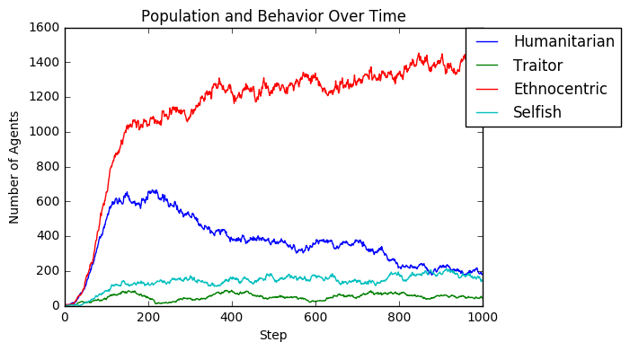
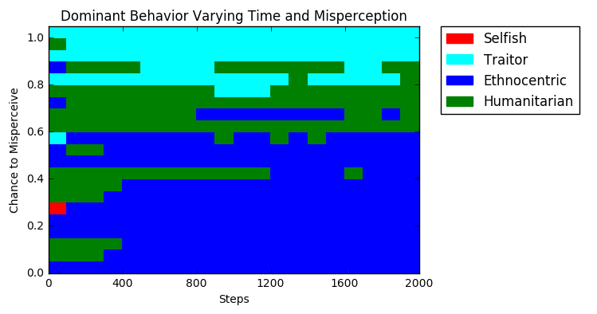
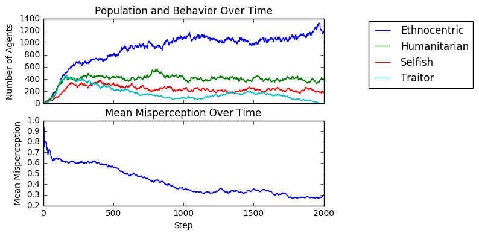
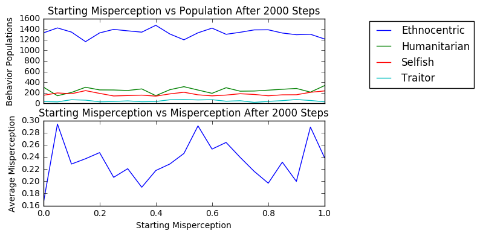

# ~~Evolving Game Strategies~~ Ethnocentrism and Misperception
#### Authors: Subhash Gubba & Kai Levy

## Abstract
We investigated game theory strategies and their implementations to see which ones emerge dominant. We used agent-based modeling (with the help of the Mesa python ABM library) to investigate it. Our first approach was to mimic the “Evolution of Ethnocentrism” experiment and try various ways to extend it in small ways. Then, we introduced misperception to the model and conducted experiments to analyze it.

## Experiment 1 - General Implementation Validation
Here we replicated the agent-based ethnicity model proposed by Hartshorn, Kaznatcheev, and Shultz.

**Question** - Does our implementation of the model perform similarly to the original model? Does the distribution of agents for each behavior over time resemble that of the original model?

**Method** - We utilized the Mesa ABM library to create our framework for the agent-based model. We implemented the steps of the model including reproduction and death of agents. We then ran the model and collected the data for analysis.

**Results** - See the results below. The first graph is the behavior distribution over 1000 steps that we attempted to recreate. And the second graph is our own simulation results over 1000 steps.

**Interpretation** - The results very closely resemble that of the original model's findings: Ethnocentrism and Humanitarianism are the leaders in the early stages, with ethnocentrism dominating by the 500th (or so) step. Traitorous is the worst performing trait, then Selfish, but neither of them die out completely.

## Experiment 2 - Varying Allowed Behaviors Validation
The paper by Hartshorn, Kaznatcheev, and Shultz also conducted experiments where they only allowed certain behaviors to be present, and measured behavior statistics for every permutation of allowed behavior.

**Question** - Does our model perform the same way the original model does when behaviors are variably included?

**Method** - We use the same model implemented, and run it for 2000 steps for each combination of allowed behavior, and then observe the average behavior counts for the last 100 steps of the simulation.

**Results** - See the results below. This first table is from the original paper. The second table is the our results.

Additionally, we converted the population statistics to percentages, and calculated the difference between the paper's results and ours. This is shown below:

**Interpretation** - Our results above seem to match relatively closely with the table from the paper. The differences in percentages depicted above are not very large (less than 5%) with the exception of the simulation where only selfish and traitorous behaviors were included. Judging based on this fact, it should be safe to say that our implementation of the model is accurate to that of the original one.

## Experiment 3 - Global Misperception
The paper by Hammond, Axelrod, Grafen does not discuss ethnocentrism very much, but does mention the effects of misperception: "The simulation results are also not very sensitive to the possibility that an agent will occasionally misperceive whether or not the other agent in the interaction has the same smell". We were inspired by this to implement some global misperception to the model.

**Question** - How does standardized misperception impact behavior distribution at our steady state? How does misperception affect the model at different points in time?

**Method** - The world is initialized with all agents having equal chance of misperceiving their neighbors. Misperceiving means the agent will randomly assume the neighbor is a different tag.

**Results** - 

This simulation was run for misperception rates of 0 to 1 at intervals of .05. The mean number of agents for each behavior of the final 100 steps of the simulation was measured at each misperception rate.

The heatmap below depicts the behavior with the highest agent count for a given time and misperception rate.

**Interpretation** - 

## Experiment 4 - Inherited Misperception
Additionally, we decided to try experiments where misperception was an attribute of every agent, rather than an attribute of the whole model.

**Question** - How does inherited misperception impact behavior distribution at our steady state? Does the attribute tend to settle? How do various initial conditions and mutation rates affect these?

**Method** - We modified our model so that each agent has a misperception attribute, which determines how likely they are to misperceive each of their neighbors. A misperceived neighbor will mean that the agent plays with the opposite strategy that they normally would. Misperception is passed down to offspring, with a mutation rate that we could specify (we used 5% as a default), meaning the child would have the same misperception value +/- 5%. We ran simulations with various initial conditions, and various mutations rates.

**Results** - 

First we show default simulation results, with 5% misperception mutation and random starting values. Below are both behavior statistics, and mean & median of misperception over time.

Below we show the same graphs when we start every agent with 0% misperception:

Next, we start every agent with 50% misperception:

And when every agent starts with 100% misperception:

Next, we swept starting conditions (with 5% mutation) from 0% to 100% and averaged the behavior & misperception stats over the last 100 steps.

And finally we swept the mutation rate (with random starting conditions) from 0% to 100% and averaged the behavior & misperception stats over the last 100 steps.

**Interpretation** -
One key take-away from these results is that even with inherited misperception, ethnocentric behavior emerges dominant. There is a clear trend for misperception to mutate down to some "steady state", which is around 30% with our default rate of 5% mutation, but as high as 50% for other mutation rates. As we saw in the previous experiments, ethnocentrism only suffered significantly when the misperception rate was very high, so this "steady-state" behavior is what allows ethnocentrism to dominate. Additionally, the starting misperception values do not seem to make a big difference in the long run of things-- regardless, the misperception trait evolves to its natural steady state.

## Learning Goals
**Subhash** - I would like to gain a better understand of how agent based models are implemented and evolved. I want to learn what types of evaluation metrics matter for our experiments and explore how this project could be applied to other fields as well.
Working through this implementation and performing the validation experiments has helped me achieve this goal. I'm beginning to see how this type of model could be used to explore other traits of societies or individuals over generations.

**Kai** - I feel like I have done a good job on my learning goals, especially considering what I wrote on the preliminary report. In the report, I expressed my desire to come up with extensions on the model, rather than just replications of the model, and I feel like our misperception extensions have acheived that. We have conducted experiments that we haven't encountered in any existing paper that can be analogous to human behavior. The extension we pursued was not overly complex but still interesting, in my opinion.

## Bibliography
- Max Hartshorna, Artem Kaznatcheeva, Thomas Shultz. “The Evolutionary Dominance of Ethnocentric Cooperation” (2013). Replicates the experiment from Hammond, Axelrod (2006). Investigates different “worlds” where certain behaviors may or may not be present, and demonstrates that humanitarianism becomes dominant in the absence of ethnocentrism, but ethnocentrism dominates otherwise.
- Ross Hammond, Robert Axelrod. “The Evolution of Ethnocentrism” (2006). Investigates prisoner’s dilemma on a grid, with four basic tags and linked behaviors. Simulates the agents by playing the game one-off, with results having implications on individual reproductivity. Demonstrates that in-group favoritism can emerge as beneficial for groups, even when individual cooperation is costly.
- Ross Hammond, Robert Axelrod, Alan Grafen. "Altruism via kin-selection strategies that rely on arbitrary tags with which they co-evolve" (2004). Analyzes through simulation (with a near-identical model to ours) and mathematics how altruism can emerge and be sustained in a co-evolutionary setting.
