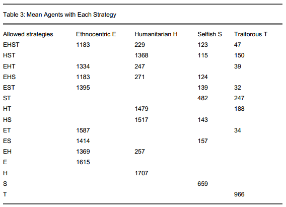
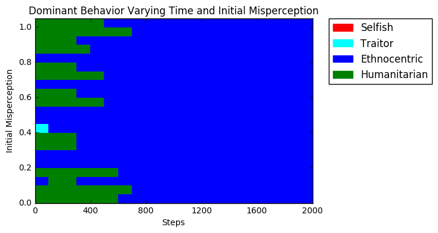
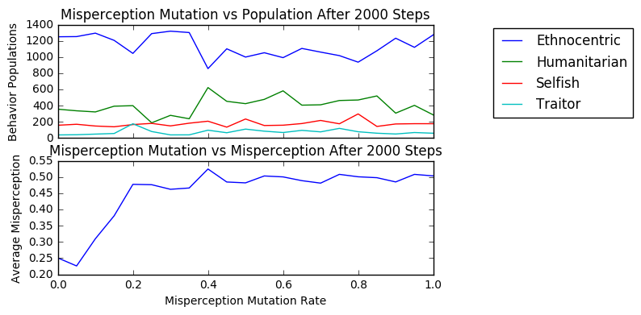

# Ethnocentrism and Misperception
#### Authors: Subhash Gubba & Kai Levy

## Abstract
We investigate human behavior and social systems by using game theory in an agent-based model. In particular, we investigate ethnocentric behavior-- where agents are inclined to help only agents like them. First we reproduce experiments about the dominance of ethnocentric behaviors using the Mesa Python ABM library. Then, we extend it by implementing misperception, the chance for an agent to wrongly identify another agent, and conduct experiments to analyze it. We find that ethnocentrism's dominance is robust, still appearing when agents are misperceiving more than 50% of the time.

## Model and Validation
To begin we replicate the agent-based ethnicity model proposed by Hartshorn, Kaznatcheev, and Shultz [1] and a few of their experiments to validate our implementation against theirs.

### Experiment 1 - General Implementation Validation

**Question** - Does our implementation of the model perform similarly to the original model? Does the distribution of agents for each behavior over time resemble that of the original model?

**Method** - We use the Mesa ABM library to create our framework for the agent-based model. We implement the steps of the model as follows:
- We create a 50x50 grid with 10 agents with random attributes. Each agent has one of four tags, which marks its "ethnicity", and one of four behaviors, which governs its reaction to other agents.
  - Humanitarian agents cooperate with all
  - Ethnocentric agents cooperate only with agents of the same tag
  - Traitorous agents cooperate only with agents of a different tag
  - Selfish agents defect against all
- At the beginning of each time step, we immigrate one agent with random attributes into an empty cell
- Every agent's potential to reproduce -`ptr`- is set to `0.12`
- Next, every agent sees each of up to four neighbors, and, based off of its behavior and the neighbor's tag, decides whether to cooperate or defect
  - If it cooperates, it reduces its own `ptr` by `0.01` and adds `0.03` to the neighbors `ptr`
- In random order, agents determine whether or not they reproduce based on their `ptr`
  - If an agent is to reproduce, it must have an empty adjacent cell
  - It creates an offspring in an adjacent cell, with the same attributes but a mutation rate of `0.005` per attribute
- Agents then determine whether or not they die by a `0.1` death rate

The first experiment from Hartshorn et al., runs the simulation for 1000 time steps. They then count agents by behaviors (**not** by ethnicity), which we shall refer to as the *behavior distribution*, and plot the counts over time. This is averaged over 50 simulations.

**Results** - See the results below.

*Behavior distribution timeseries from Hartshorn et al.*

*Our behavior distribution timeseries.*

**Interpretation** - The results closely resemble that of the original model's findings: Ethnocentrism and Humanitarianism are the leaders in the early stages, with Ethnocentrism dominating by approximately the 500th step. Traitorous is the worst performing trait, then Selfish, but neither of them die out completely.

### Experiment 2 - Varying Allowed Behaviors Validation
Hartshorn et al. conduct experiments where they only allow certain behaviors to be present, and measure behavior statistics for every permutation of allowed behavior.

**Question** - Does our model perform the same way the original model does when certain behaviors are included or excluded? Is our implementation a valid one?

**Method** - The model is run with the powerset of all behaviors: E, H, S, and T. For each subset:
- Model is run for 2000 steps
- Last 100 steps behavior counts are averaged
- This process is repeated 10 times and final counts are averaged

**Results** - See the results below. This first table is from the Hartshorn et al. The second table contains our results.

*Hartshorn et al. behavior counts*

*Our behavior counts*

Additionally, we convert the population statistics to percentages, and calculate the difference between the Hartshorn et al. results and ours. This is shown below:

*Percent differences between tables*

**Interpretation** - Our results match closely with the table from Hartshorn et al. The differences in percentages depicted above are small (less than 5%) with the exception of the simulation where only selfish and traitorous behaviors were included. Based on these results, it should be safe to say that our implementation of the model is accurate to the original one.

## Extensions with Misperception
Hammond, Axelrod, and Grafen [3] present a very similar model to ours. Additionally, they mention the effects of misperception: "The simulation results are also not very sensitive to the possibility that an agent will occasionally misperceive whether or not the other agent in the interaction has the same smell".  However, they do not provide more evidence or experiments.

We implement misperception in our model, in two separate ways-- by having every agent misperceive at the same rate, and by having agents pass down a misperception attribute to offspring. In either case, an agent misperceiving its neighbor determines its own strategy by "smelling" the neighbor as a random ethnicity.

### Experiment 3 - Global Misperception
Our first experiment involves a model-wide misperception chance.

**Question** - How does misperception at a global level impact behavior distribution at our steady state? At what level of misperception does the behavior distribution change significantly? How does misperception affect the model at different points in time?

**Method** - The world is initialized with all agents having equal chance of misperceiving their neighbors, between 0 and 1.
- When an agents interacts with a neighbor, it may misperceive the neighbor, by the misperception chance.
- If it does misperceive, it randomly chooses at tag that it perceives the neighbor to be, out of the 4 tags.
- It then uses the strategy of the tag it perceives to determine whether it cooperates or defects
- If it doesn't misperceives, it plays normally

**Results** -

*Behavior distribution with global misperception set to 40% chance. Ethnocentrism dominates without too much trouble, and the distribution looks much like the original experiment.*

*Behavior distribution with global misperception set to 80% chance. Ethnocentrism struggles (finishes in second) while humanitarianism dominates, and traitorous does better than selfish.*

*Behavior distribution with global misperception set to 100%. Ethnocentrism does even worse than traitorous.*

Then we seep misperception from 0-100% with intervals of 5%, and examine behavior distributions.

*The mean number of agents for each behavior of the final 100 steps of the simulation was measured at each misperception rate. As misperception rises, ethnocentrism does worse, losing out to humanitarianism at 80%. Traitorous does slightly better with high misperception.*

*The cell graph above depicts the behaviors with the highest agent counts for a given time and misperception rate. As misperception rises, humanitarianism stays top for longer at the beginning.*

**Interpretation** - Where as in a world with 0 misperception ethnocentrism dominates, a world riddled with misperception gives way to humanitarianism. The first three time series indicate how increased introduction of global misperception increases the advantage held by humanitarian behaviors. steady state behavior also indicates misperception is negatively correlated with ethnocentric success, but also demonstrates the robustness of ethnocentric strategies which only breaks down at a critical point of 80% misperception rates. Beyond this, humanitarians emerge victorious. Our cell graph demonstrates how, as misperception rises, the period of early humanitarian dominance lasts for longer, even if ethnocentrism comes out on top.

Ethnocentrism struggles when global misperception is high-- above 70%. It still dominates despite lower levels of misperception, demonstrating the robustness that Hammond et al. mentioned, although it does take longer to emerge as the parameter approaches the critical value. But what happens if we allow misperception to be inherited?

### Experiment 4 - Inherited Misperception
Additionally, we experiment with misperception as an attribute of every agent, rather than an attribute of the whole model.

**Question** - How does inherited misperception impact behavior distribution at our steady state, and how does it compare to global misperception? Does the attribute tend to settle? How do various initial conditions and mutation rates affect these?

**Method** - We modified our model so that each agent has a misperception attribute, which determines how likely they are to misperceive each of their neighbors.
- It works the same as global misperception, but each agent uses its own attribute to determine whether it misperceives.
- Misperception is passed down to offspring in the reproduction phase, with a mutation rate that we could specify (we use 5% as a default), meaning the child would have the same misperception value +/- 5%.

We ran simulations with various initial conditions, and various mutations rates.

**Results** -

We run full simulations for certain initial conditions:

*Default run with random starting misperception and 5% mutation. On the top are behaviors distributions, where ethnocentrism dominates after an early humanitarian lead. On the bottom is the mean misperception which spikes early before settling at around 25%.*

*Misperception is initialized at 0%, with 5% mutation. Ethnocentrism dominates the whole way. Mean misperception rises off the bottom early, but settles at about 20% by the end.*

*Misperception is initialized at 50%, with 5% mutation. Ethnocentrism wins out with slightly more struggle, and misperception spikes early before settling at about 30%.*

*Misperception is initialzed at 100%, with 5% mutation. Ethnocentrism dominates after an early struggle, and misperception drops sharply early, before settling down to about 30%.*

Additionally, we sweep starting misperception in increments of 5% and average the last 100 timesteps to see "steady state" conditions.

*Last 100 timestep average of initialization sweep. Ethnocentrism ends up well on top regardless of the initial condition, and the behavior distribution is steady regardless. The misperception steady state spikes slightly, but is largely in the range of 20%-30%.*

*Cell graph displaying dominant behavior over time for the same sweep as above. Ethnocentrism is largely dominant, with some pockets of early humanitarian dominance-- but not apparently correlated to initial misperception.*

Finally, we sweep the misperception mutation rate (with default initialization), in increments of 5% and average the last 100 timesteps as above.

*The mean number of agents for each behavior of the final 100 steps simulations with mutation sweep. Ethnocentrism still dominates in the end, although slightly less convincingly than most other simulations. Humanitarianism does slightly better, and the misperception mean settles at 45-50% in most cases when mutation is above 20%.*

*Cell graph of above sweep, showing ethnocentric dominance despite early humanitarian improvements.*

**Interpretation** -
One key take-away from these results is that even with inherited misperception, ethnocentric behavior emerges dominant. There is a clear trend for misperception to mutate down to a steady state, which is around 25-30% with our default rate of 5% mutation, but as high as 50% for higher mutation rates. As we saw in the previous experiments, ethnocentrism only suffered significantly when the misperception rate was very high, so this steady state behavior is what allows ethnocentrism to dominate. We can see that while misperception remains high, humanitarianism does well. However, it is generally disadvantageous for agents (especially ethnocentric ones) to misperceive their neighbors, so the decline of misperception towards its steady state closely matches the rise of ethnocentrism in our simulations. Additionally, the starting misperception values do not make a big difference in the long run of things-- regardless, the misperception trait evolves to its natural steady state.

When misperception has a much smaller effect on the behavior distribution when it is an inherited trait, as opposed to a model parameter. It tends to settle at a steady state that is below 60%, but above 0-- and it wasn't until misperception was above 70% in the previous experiment that ethnocentrism really struggled. Similarly, ethnocentrism emerges dominant regardless of the initial conditions. A rise in ethnocentrism and a fall in misperception are correlated, as large ethnocentric groups benefit from perceiving their neighbors correctly, and as they grow, misperception is mutated towards its steady state.

## Bibliography
1. Max Hartshorn, Artem Kaznatcheev, Thomas Shultz. “The Evolutionary Dominance of Ethnocentric Cooperation” (2013). Replicates the experiment from Hammond, Axelrod (2006). Investigates different “worlds” where certain behaviors may or may not be present, and demonstrates that humanitarianism becomes dominant in the absence of ethnocentrism, but ethnocentrism dominates otherwise.
2. Ross Hammond, Robert Axelrod. “The Evolution of Ethnocentrism” (2006). Investigates prisoner’s dilemma on a grid, with four basic tags and linked behaviors. Simulates the agents by playing the game one-off, with results having implications on individual reproductivity. Demonstrates that in-group favoritism can emerge as beneficial for groups, even when individual cooperation is costly.
3. Ross Hammond, Robert Axelrod, Alan Grafen. "Altruism via kin-selection strategies that rely on arbitrary tags with which they co-evolve" (2004). Analyzes through simulation (with a near-identical model to ours) and mathematics how altruism can emerge and be sustained in a co-evolutionary setting.
