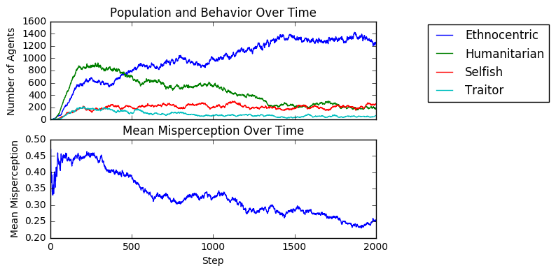
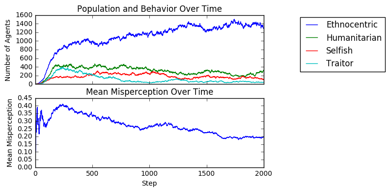
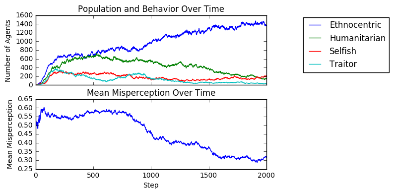

# Ethnocentrism and Misperception
#### Authors: Subhash Gubba & Kai Levy

## Abstract
We investigate game theory strategies and their implementations to see which ones emerge dominant. We use agent-based modeling (with the help of the Mesa Python ABM library) to investigate it. Our first approach is to mimic the “Evolution of Ethnocentrism” experiment and try various ways to extend it in small ways. Then, we introduce misperception to the model and conduct experiments to analyze it.

## Model and Validation
To begin we replicate the agent-based ethnicity model proposed by Hartshorn, Kaznatcheev, and Shultz [1] and a few of their experiments to validate our implementation against theirs.

### Experiment 1 - General Implementation Validation

**Question** - Does our implementation of the model perform similarly to the original model? Does the distribution of agents for each behavior over time resemble that of the original model?

**Method** - We use the Mesa ABM library to create our framework for the agent-based model. We implement the steps of the model as follows:
- We create a 50x50 grid with 10 agents with random attributes. Each agent has one of four tags, which marks its "ethnicity", and one of four behaviors, which governs its reaction to other agents.
  - Humanitarian agents cooperate with all
  - Ethnocentric agents cooperate only with agents of the same tag
  - Traitorous agents cooperate only with agents of a different tag
  - Selfish agents defect against all
- At the beginning of each time step, we immigrate one agent with random attributes into an empty cell
- Every agent's potential to reproduce (`ptr`) is set to 0.12
- Next, every agent sees each of up to four neighbors, and, based off of its behavior and the neighbor's tag, decides whether to cooperate or defect
  - If it cooperates, it reduces its own `ptr` by `0.01` and adds `0.03` to the neighbors `ptr`
- In random order, agents determine whether or not they reproduce based on their `ptr`
  - If an agent is to reproduce, it must have an empty adjacent cell
  - It creates an offspring in an adjacent cell, with the same attributes but a mutation rate of `0.005` per attribute
- Agents then determine whether or not they die by a `0.1` death rate

The first experiment from Hartshorn et al., runs the simulation for 1000 time steps. They then count agents by behaviors (**not** by ethnicity), which we shall refer to as the *behavior distribution*, and plot the counts over time. This is averaged over 50 simulations.

**Results** - See the results below.

*Behavior distribution timeseries from Hartshorn et al.*

*Our behavior distribution timeseries*

**Interpretation** - The results closely resemble that of the original model's findings: Ethnocentrism and Humanitarianism are the leaders in the early stages, with Ethnocentrism dominating by approximately the 500th step. Traitorous is the worst performing trait, then Selfish, but neither of them die out completely.

### Experiment 2 - Varying Allowed Behaviors Validation
The paper by Hartshorn, Kaznatcheev, and Shultz also conducted experiments where they only allowed certain behaviors to be present, and measured behavior statistics for every permutation of allowed behavior.

**Question** - Does our model perform the same way the original model does when behaviors are variably included?

**Method** - We use the same model implemented, and run it for 2000 steps for each combination of allowed behavior, and then observe the average behavior counts for the last 100 steps of the simulation.

**Results** - See the results below. This first table is from the original paper. The second table is the our results.

Additionally, we converted the population statistics to percentages, and calculated the difference between the paper's results and ours. This is shown below:

**Interpretation** - Our results above seem to match relatively closely with the table from the paper. The differences in percentages depicted above are not very large (less than 5%) with the exception of the simulation where only selfish and traitorous behaviors were included. Judging based on this fact, it should be safe to say that our implementation of the model is accurate to that of the original one.

## Extensions with Misperception
Hammond, Axelrod, and Grafen [3] present a very similar model to ours. Additionally, they mention the effects of misperception: "The simulation results are also not very sensitive to the possibility that an agent will occasionally misperceive whether or not the other agent in the interaction has the same smell".  However, they do not much more evidence or experiments.

We implement misperception in our model, in two separate ways-- by having every agent misperceive at the same rate, and by having agents pass down a misperception attribute to offspring. In either case, an agent misperceiving its neighbor determines its own strategy by "smelling" the neighbor as a random ethnicity.

### Experiment 3 - Global Misperception

**Question** - How does misperception at a global level impact behavior distribution at our steady state? How does misperception affect the model at different points in time?

**Method** - The world is initialized with all agents having equal chance of misperceiving their neighbors, between 0 and 1.
- When an agents interacts with a neighbor, it may misperceive the neighbor, by the misperception chance.
- If it does misperceive, it randomly chooses at tag that it perceives the neighbor to be, out of the 4 tags.
- It then uses the strategy of the tag it perceives to determine whether it cooperates or defects
- If it doesn't misperceives, it plays normall

**Results** -

This simulation was run for misperception rates of 0 to 1 at intervals of .05. The mean number of agents for each behavior of the final 100 steps of the simulation was measured at each misperception rate.

The heatmap below depicts the behavior with the highest agent count for a given time and misperception rate.

**Interpretation** - It appears to be advantageous for traitorous behavior in conditions of high misperception. This makes intuitive sense because traitors have exposure to more cooperation possibilities when the chance of misperceiving is higher. As expected, Ethnocentrism succeeds in the most regions. Global misperception clearly has an impact on the model throughout time. A critical point for misperception shown by both graphs is around between 0.6 and 0.8 where the most successful behavior is in flux.

### Experiment 4 - Inherited Misperception
Additionally, we decided to try experiments where misperception was an attribute of every agent, rather than an attribute of the whole model. This implementation also has the rules that when an agent misperceives, it randomly selects which ethnicity to perceive-- which may be the correct one.

**Question** - How does inherited misperception impact behavior distribution at our steady state? Does the attribute tend to settle? How do various initial conditions and mutation rates affect these?

**Method** - We modified our model so that each agent has a misperception attribute, which determines how likely they are to misperceive each of their neighbors. A misperceived neighbor will mean that the agent plays with the opposite strategy that they normally would. Misperception is passed down to offspring, with a mutation rate that we could specify (we used 5% as a default), meaning the child would have the same misperception value +/- 5%. We ran simulations with various initial conditions, and various mutations rates.

**Results** -

First we show default simulation results, with 5% misperception mutation and random starting values. Below are both behavior statistics, and mean & median of misperception over time.

Below we show the same graphs when we start every agent with 0% misperception:

Next, we start every agent with 50% misperception:

And when every agent starts with 100% misperception:

Next, we swept starting conditions (with 5% mutation) from 0% to 100% and averaged the behavior & misperception stats over the last 100 steps.

And finally we swept the mutation rate (with random starting conditions) from 0% to 100% and averaged the behavior & misperception stats over the last 100 steps.

**Interpretation** -
One key take-away from these results is that even with inherited misperception, ethnocentric behavior emerges dominant. There is a clear trend for misperception to mutate down to some "steady state", which is around 30% with our default rate of 5% mutation, but as high as 50% for other mutation rates. As we saw in the previous experiments, ethnocentrism only suffered significantly when the misperception rate was very high, so this "steady-state" behavior is what allows ethnocentrism to dominate. Additionally, the starting misperception values do not seem to make a big difference in the long run of things-- regardless, the misperception trait evolves to its natural steady state.

## Remaining Work
We are still trying to iron out some questions which can be more analogous to human behavior, rather than just the implementation of our model. Additionally, we will likely modify the global misperception experiment to do the same random choice as the agent one, so that agents may "correctly misperceive".

## Learning Goals
**Subhash** - I would like to gain a better understand of how agent based models are implemented and evolved. I want to learn what types of evaluation metrics matter for our experiments and explore how this project could be applied to other fields as well.
Working through this implementation and performing the validation experiments has helped me achieve this goal. I'm beginning to see how this type of model could be used to explore other traits of societies or individuals over generations.

**Kai** - I feel like I have done a good job on my learning goals, especially considering what I wrote on the preliminary report. In the report, I expressed my desire to come up with extensions on the model, rather than just replications of the model, and I feel like our misperception extensions have acheived that. We have conducted experiments that we haven't encountered in any existing paper that can be analogous to human behavior. The extension we pursued was not overly complex but still interesting, in my opinion.

## Bibliography
1. Max Hartshorn, Artem Kaznatcheev, Thomas Shultz. “The Evolutionary Dominance of Ethnocentric Cooperation” (2013). Replicates the experiment from Hammond, Axelrod (2006). Investigates different “worlds” where certain behaviors may or may not be present, and demonstrates that humanitarianism becomes dominant in the absence of ethnocentrism, but ethnocentrism dominates otherwise.
2. Ross Hammond, Robert Axelrod. “The Evolution of Ethnocentrism” (2006). Investigates prisoner’s dilemma on a grid, with four basic tags and linked behaviors. Simulates the agents by playing the game one-off, with results having implications on individual reproductivity. Demonstrates that in-group favoritism can emerge as beneficial for groups, even when individual cooperation is costly.
3. Ross Hammond, Robert Axelrod, Alan Grafen. "Altruism via kin-selection strategies that rely on arbitrary tags with which they co-evolve" (2004). Analyzes through simulation (with a near-identical model to ours) and mathematics how altruism can emerge and be sustained in a co-evolutionary setting.
