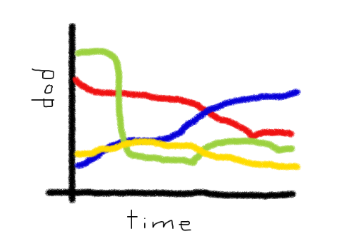
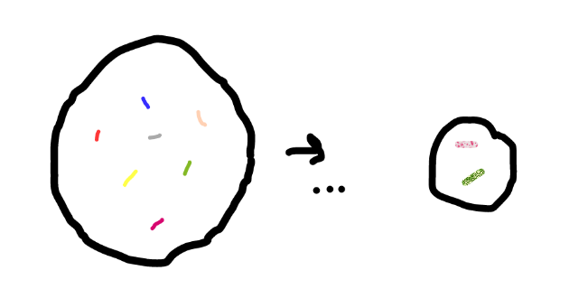

# Evolving Game Strategies
## Abstract
We will investigate evolutionary game theory strategies and their implementations to see which ones emerge dominant. We intend to use agent-based modeling to investigate it. Our first approach will be to mimic the “Evolution of Ethnocentrism” experiment and try various ways to extend it in small ways. A possible reach extension of this project could include implementing a genetic algorithm to see which aspects of strategies might appear in successful ones.

## Experiments and Extensions
#### Agent-based Prisoner’s Dilemma (Ethnocentrism)
- Play a modified game
- Introduce more behaviors than the 4
- Multiple ‘ethnicities’
- Different rules for reproduction and immigration
- More cognitive abilities and iterative game playing
- Resources and land interaction
- Possible Ethnicity Blending

#### Prisoner’s Dilemma and Genetic Algorithms
- Each round is a set of games
- Evaluate fitness of each player
- The best fitted individuals

## Expected Results

Example population time-series of 1st experiment, where we look at relative dominance of different behaviors, with different starting parameters.

Example genetic pools for the second experiment

## Learning Goals
#### Kai
I would like to produce a model with insightful results, particularly with regard to the domain of human behavior. Additionally, I would like to gain more intuition and experience with fundamentals of complex models.

#### Subhash
I would like to gain a better understand of how agent based models are implemented and evolved. I want to learn what types of evaluation metrics matter for our experiments and explore how this project could be applied to other fields as well.

## Bibliography
- Ross Hammond, Robert Axelrod. [“The Evolution of Ethnocentrism” (2006).](
http://citeseerx.ist.psu.edu/viewdoc/download?doi=10.1.1.576.4696&rep=rep1&type=pdf.)
  *Investigates prisoner’s dilemma on a grid, with four basic tags and linked behaviors. Simulates the agents by playing the game one-off, with results having implications on individual reproductivity. Demonstrates that in-group favoritism can emerge as beneficial for groups, even when individual cooperation is costly.*

- Max Hartshorna, Artem Kaznatcheeva, Thomas Shultz. [“The Evolutionary Dominance of Ethnocentric Cooperation” (2013).](http://jasss.soc.surrey.ac.uk/16/3/7.html)
*Replicates the experiment from Hammond, Axelrod (2006). Investigates different “worlds” where certain behaviors may or may not be present, and demonstrates that humanitarianism becomes dominant in the absence of ethnocentrism, but ethnocentrism dominates otherwise.*

- Jennifer Golbeck. ["Evolving Strategies for the Prisoner’s Dilemma" (2002).](https://www.cs.umd.edu/~golbeck/downloads/JGolbeck_prison.pdf)
*This paper applies a genetic algorithm to the Prisoner’s Dilemma and evaluates the resulting winning strategies against two well-known effective strategies: Pavlov and Tit-for-tat. Each round of the algorithm is a series of multiple games with randomly strategized players, and the emerging strategies show aspects of the two control strategies.*

- Wikipedia. ["List of games in game theory".](https://en.wikipedia.org/wiki/List_of_games_in_game_theory)
*Contains a list of games for which we may apply agent-based models and evolutionary strategies in game theory.*
